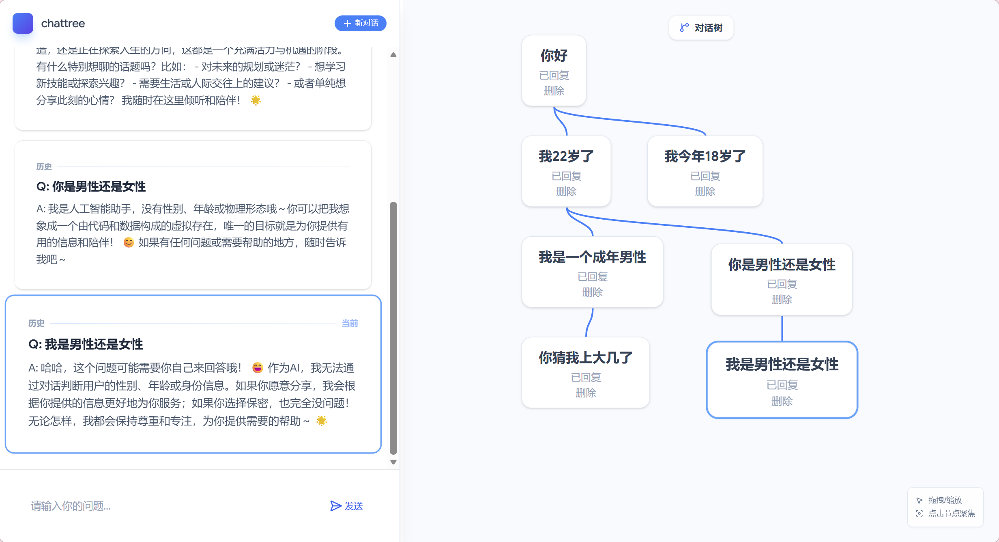

# ChatTree - 对话树可视化应用

## 📋 项目介绍

ChatTree 是一个基于对话树结构的 AI 对话可视化应用。与传统线性聊天界面不同，本应用将对话组织成树状结构，允许用户在不同分支上探索不同的对话路径，创建多轮、多分支的复杂对话场景。



### ✨ 核心特性

- **🌳 可视化对话树**：实时生成对话树形图，直观展示对话脉络
- **🔀 多分支对话**：支持从任意节点发起新的对话分支
- **🗺️ 可交互地图**：支持拖拽、缩放操作，自由探索对话空间
- **🎯 智能聚焦**：点击节点可聚焦查看完整对话历史
- **⚡ 流式响应**：集成 DeepSeek API，支持实时流式输出
- **🎨 现代界面**：采用 Tailwind CSS + Lucide Icons 构建的优雅界面

## 🚀 快速部署

### 前置要求
- 现代浏览器（Chrome 90+, Firefox 88+, Safari 14+）
- DeepSeek API Key（可从 https://platform.deepseek.com/ 获取）

### 部署方式

#### 方式一：直接使用（在线部署）
将提供的 HTML 文件部署到任意静态托管服务：
```bash
# 使用 Netlify
netlify deploy --dir .

# 使用 Vercel
vercel --prod

# 或直接上传到 GitHub Pages
```

#### 方式二：本地运行
1. 下载 `chat_tree.html` 文件
2. 在文件中替换您的 DeepSeek API Key：
   ```javascript
   const DEEPSEEK_API_KEY = 'sk-your-api-key-here';
   ```
3. 直接在浏览器中打开文件，或通过本地服务器运行：
   ```bash
   # 使用 Python
   python -m http.server 8000
   
   # 或使用 Node.js
   npx http-server .
   ```

## 🎮 使用指南

### 基础操作
1. **开始对话**：在底部输入框输入问题，按回车或点击发送按钮
2. **查看对话树**：右侧自动生成对话树，展示所有对话节点
3. **导航对话**：
   - 点击任意节点：聚焦查看该节点及其完整历史
   - 拖拽节点：重新排列对话树布局
   - 拖拽画布空白处：平移整个对话树
   - 使用滚轮：缩放对话树视图

4. **创建分支**：
   - 点击任一节点使其成为当前焦点
   - 输入新问题，将在该节点下创建新的对话分支
   - 点击"新对话"按钮：重置焦点，开始全新对话树

5. **删除节点**：点击节点的删除按钮（注意：删除节点会断开该节点与父子节点的连接）


## 🏗️ 技术架构

### 前端技术栈
- **核心框架**：原生 HTML5 + JavaScript（ES6+）
- **样式方案**：Tailwind CSS 实用类优先框架
- **图标系统**：Lucide Icons 现代化图标库
- **数学渲染**：KaTeX 数学公式渲染引擎
- **响应式设计**：基于视口的自适应布局

### 核心组件设计

#### 1. 数据模型
```javascript
// 对话节点数据结构
{
  id: "node_1",              // 唯一标识符
  parentId: "node_0",        // 父节点ID（null表示根节点）
  question: "用户提问内容",
  answer: "AI回复内容",
  children: ["node_2", "node_3"], // 子节点ID数组
  x: 100,                    // 画布X坐标
  y: 100,                    // 画布Y坐标
  pending: false             // 是否等待回复中
}
```

#### 2. 对话历史构建
- **上下文管理**：通过回溯父节点链构建完整对话历史
- **消息格式化**：将对话历史转换为 DeepSeek API 要求的 messages 数组格式
- **系统提示词**：内置默认系统角色设定，可自定义修改

#### 3. 可视化引擎
- **SVG 连线**：使用动态 SVG 路径绘制节点间连接线
- **变换系统**：基于 CSS transform 的平移缩放系统
- **碰撞检测**：自动计算节点布局，避免重叠
- **边界计算**：动态调整 SVG 画布大小以适应节点分布

#### 4. API 集成
- **流式处理**：使用 Fetch API 的 ReadableStream 处理流式响应
- **实时更新**：逐字渲染 AI 回复，提供即时反馈
- **错误处理**：完整的网络错误和 API 错误处理机制

### 关键算法

#### 节点布局算法
```javascript
// 基于父节点位置和现有子节点数计算新节点位置
function calculateNodePosition(parentNode, siblingCount) {
  if (!parentNode) {
    // 根节点：水平排列
    return { x: 100 + siblingCount * 150, y: 100 };
  } else {
    // 子节点：垂直偏移，水平分布
    return {
      x: parentNode.x + siblingCount * 150,
      y: parentNode.y + 120
    };
  }
}
```

#### 对话历史回溯
```javascript
function buildConversationHistory(startNodeId) {
  const history = [];
  let currentNodeId = startNodeId;
  
  // 向上回溯到根节点
  while (currentNodeId) {
    const node = findNodeById(currentNodeId);
    if (node) {
      history.unshift(node); // 向前插入，保持时间顺序
      currentNodeId = node.parentId;
    } else {
      break;
    }
  }
  return history;
}
```


## 🛡️ 注意事项

### 安全性
1. **API Key 保护**：请勿在公开仓库中提交真实的 API Key
2. **CORS 限制**：当前为前端直接调用 API，需确保 API 支持 CORS
3. **数据持久化**：当前版本未实现本地存储，刷新页面数据会丢失

### 性能优化
1. **节点数量**：建议单会话不超过 50 个节点以保证流畅性
2. **对话长度**：过长的对话历史可能影响 API 响应速度
3. **画布渲染**：大量节点时 SVG 连线可能需要性能优化

## 📄 许可证
本项目为开源项目，遵循 MIT 许可证。可自由使用、修改和分发。

---

**开始你的对话树探索之旅吧！** 🌳✨
